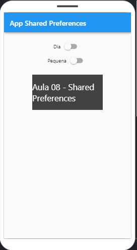
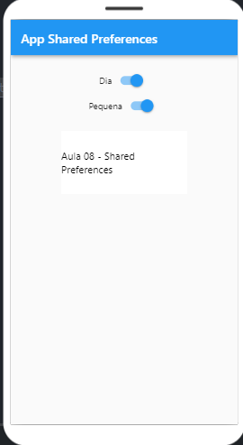

## appSharedPreferences

- Conteúdo criado nas aulas de MOBILE HÍBRIDO DEVELOPMENT

## Modo de Uso

Existe 2 botões em switch cada um com sua função e armazenando o status com o Shared Preferences:

- botão "Dia" quando estiver ligado o fundo fica branco e texto altera para cor preta;
- botão "Pequena" quando estiver ligado diminue a letra do texto;

## Exemplos

